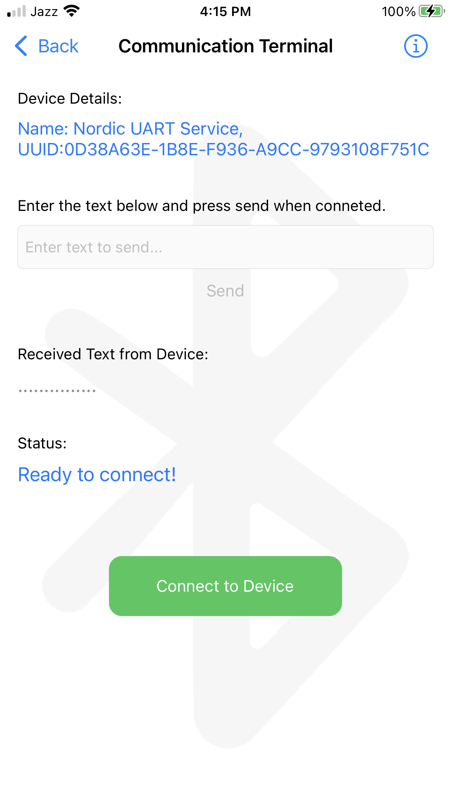
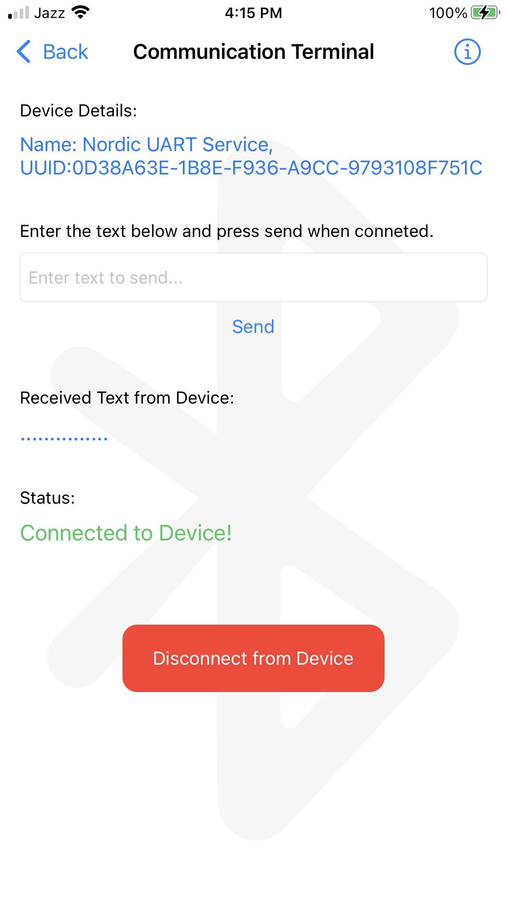
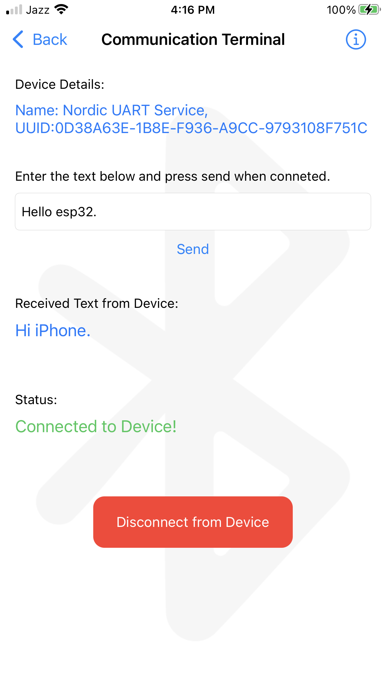

# BLE Serial IOs Example

This is a simple app, which scans for BLE Peripherials and connect to them. The example works with NORDIC_UART_SERVICE.

# UUIDS

Here are the UUIDS:

SERVICE_UUID:           "6E400001-B5A3-F393-E0A9-E50E24DCCA9E"

CHARACTERISTIC_UUID_RX: "6E400002-B5A3-F393-E0A9-E50E24DCCA9E"

CHARACTERISTIC_UUID_TX: "6E400003-B5A3-F393-E0A9-E50E24DCCA9E"

# How to Run the App

Clone the source code and open it in xCode. You'll need an apple computer and an actual iPhone to run it. The emulator wont work with BLE. Connect an iPhone with a USB cable and run the application and scan for devices.

# Screenshots

Here are some screenshots of the iPhone communication with esp32 using Nordic UART Service.

## Splash Screen

This is the splash screen for the app.

## Scan Screen

Press the scan button to start scanning for BLE Peripherals. Select a device to connect to it.

## Communication Terminal Screen

Press the connect button to connect to the device.

# Communication

Presing the Connect Button creates a connection with the esp32.

## Device Connected

## Exchanging Messages

Once Connected, then we can exchange text messages between iPhone and the esp32.

## Info

This messages opens when the info button is presses on the top-right corner of the screen.

